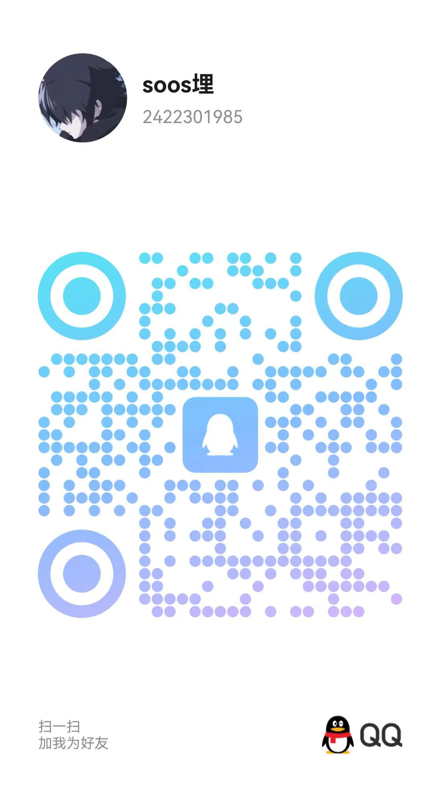

## 我会些什么

- vue框架前端开发，熟练掌握css、js等前端开发技巧和技术。
- 后端简单的java、php和python的django框架。
- 简单的docker容器部署、ansible自动化运维工具脚本编写。
- 简单的网络安全防护与攻击，sql注入漏洞、反序列化漏洞、pwn二进制漏洞。
- 简单的acm算法知识，动态规划、寻路算法等基本算法。
- 小程序前端开发，uni-app等框架。

## 此网站用于做什么

- 日常开发遇到bug的解决思路分享。
- 日常学习的记录与分享。
- 分享和记录开发技巧和开发思路。

## 欢迎各位大佬与我交流     

欢迎添加好友交流

  

    
QQ: 2422301985

    
  

  
  

    
WeChat: jayjay0218

    
  

## 计算机学习编年史

**2022.6-2022.8**  
第一次正式接触计算机，以前对计算机的概念只有4399。  
由于不会安装软件，把所有的软件装在了C盘。  
因为对编程兴趣浓厚，第一个装的软件是Python的解释器。顺带装了pycharm、sql server等软件。（但是因为第一次使用电脑，这一次安装直接导致系统环境炸裂，遗留问题一直留存到了现在）  

**2022.8-2022.9**  
收到浙工大软外录取通知书。  
两个月学习了启蒙语言Python，照着书抄了一个飞机大战的游戏，后来突然有灵感花两个小时搓了个贪吃蛇。  
不过当时对编程不清楚，不知道包等概念，只是单纯让程序跑起来了。  

**2022.9-2023.1**  
入学。学习C语言和一点点C++语言。  
大一玩了很多游戏。  
大一没有什么作为。

**2023.1-2023.3**  
偶然机会，第一次参了寒假软件设计大赛。  
用Java语言编写，两个星期学完所有的Java基础和swing框架。  
完成了第一个成型项目，虽然做的比较潦草，而且大部分不是我写的。  

**2023.3-2023.6**  
大一下开学。  
学习了简单的Java通讯编程，socket传输等。  
报了ctf通识课，但是当时并不感兴趣。  
顺便学了点acm算法，不过不太感兴趣没有坚持。  
上了lxx老师的面向对象的程序设计，对面向对象的编程思想大为赞同。  

**2023.6-2023.7**  
独立完成了第一个JavaSwing五子棋项目。在这之中第一次独立使用了多线程编程，多线程管理，socket通讯编程。有了简单的C/S概念，照着自己的想法设计了一套服务器转接发消息的功能。并且自己照着网上的一些教程，设计了一个和我自己55开五子棋人机。  
期末突击的CTF校赛中，只会杂项混了个校一。  

**2023.7-2023.10**  
暑假进修前端技术。HTML+css+js，学了巨量的css知识。并且收到了ctf省赛的通知。

**2023.10-2023.11**  
大二上开学。学业相当繁忙，偶然机会加入了学校新起步的ctf战队，成功入驻b113实验室。  
为了省赛两星期突击了ctf攻防知识，第一次攻破web题，突击学习了php反序列化漏洞知识，成功挺进决赛拿下省二。  

**2023.11-2024.1**  
由于入驻人才济济的b113，同时网安对计算机知识要求范围极其广泛，计算机知识飙升。  
在这期间学会了简单的Linux指令，web攻防。  
第一次听Vue框架和前后端分离开发。  
了解了服务器、docker（但是不会用）、虚拟机、Linux、通讯协议、计算机通讯方式。  
顺便靠着里面的人学会了git使用。  
学了点Javaweb，简单的koa框架。懂了点后端开发知识。 
在战队的人的帮助下，挂上了梯子，使用了chatgpt和copliot，对我学习提供了极大的帮助。  

**2024.1-2024.2**  
独立完成了PHP课设，比较圆满的完成了大二上学习。偶然的机会得到lxx老师赏识。  

**2024.2-2024.3**  
学习Vue框架，同时接手了三个前端项目。第一次使用APIfox、进行前后端分离开发、使用github进行项目管理、使用前端组件库、学习了echarts。  

**2024.3-2024.4**  
大二下开学，偶然机会加入了一个中国电信和lxx老师合作的网络拨测项目，负责Python后端开发工作。简单了解了Django、ansible和数据库后，着手进入了第一次实习。  

**2024.4-2024.5.31**  
结束实习生活。  
在开发过程中，学会了LinuxShell脚本，docker环境集成部署。顺手搭了个人的博客，了解了标准的企业项目开发流程。  

**2024.6-至今**  
忙于期末备考。 
准备进入ciscn分区赛。  
期间CTF校赛拿了个特等奖。  

（更多的知识还是来自于CSDN和B站，比如cmd命令、什么是环境变量等等计算机基础知识）