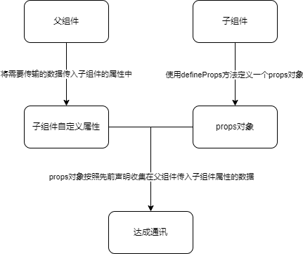
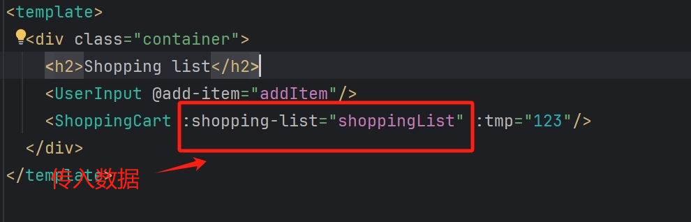
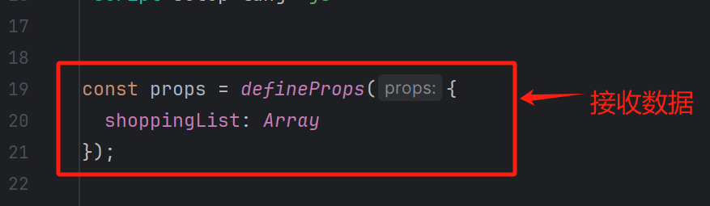
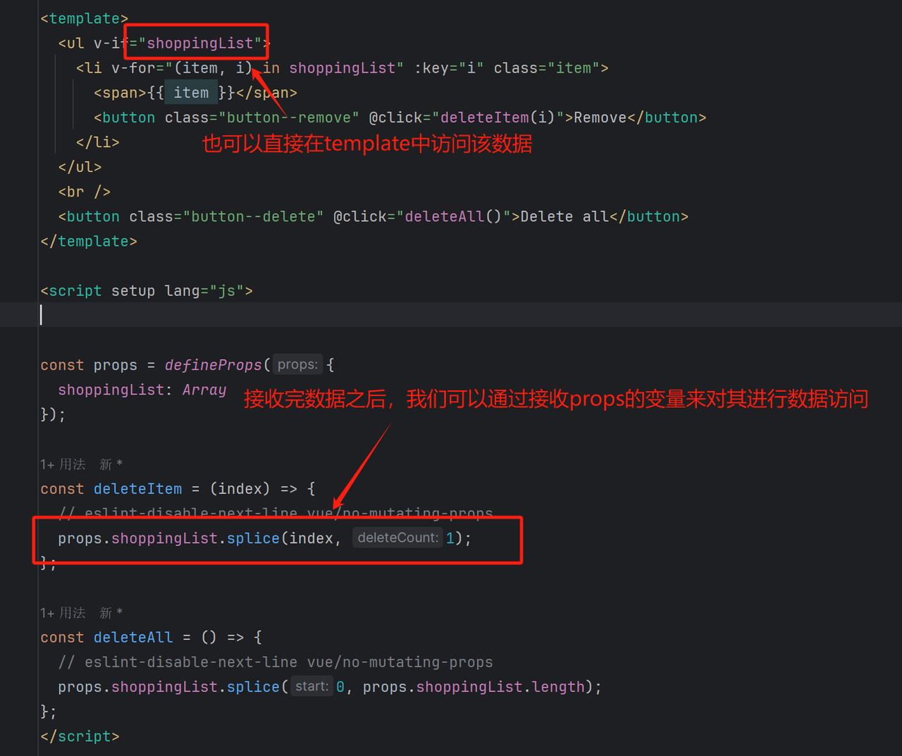
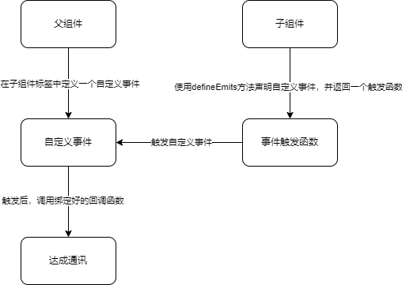
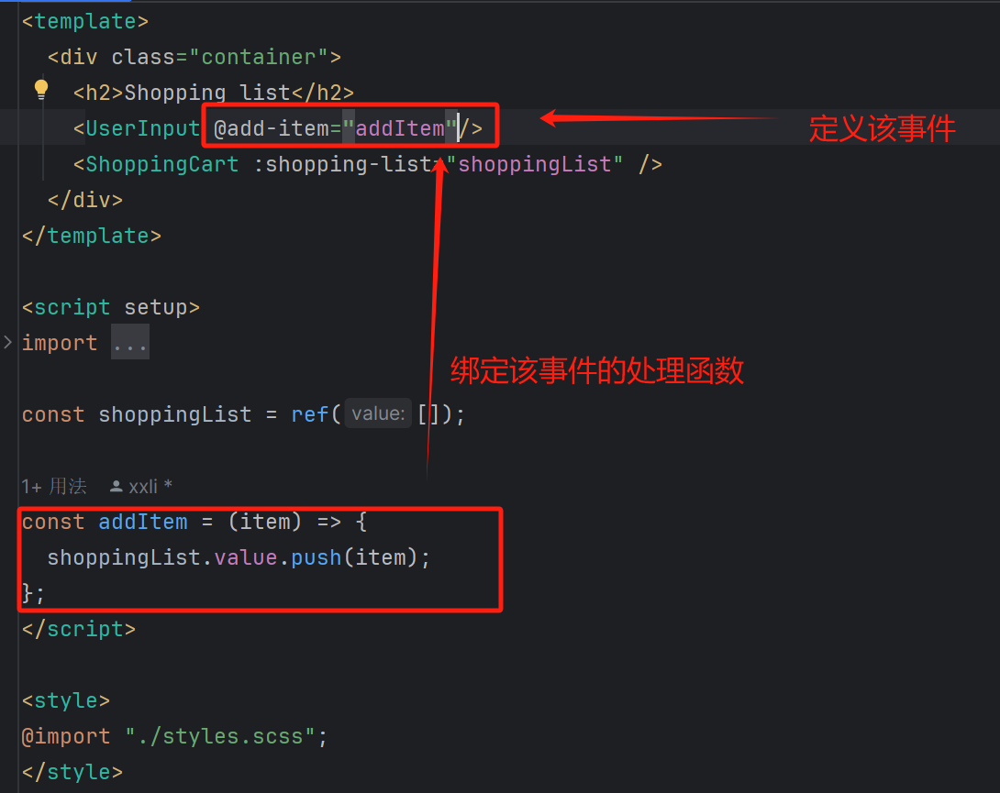
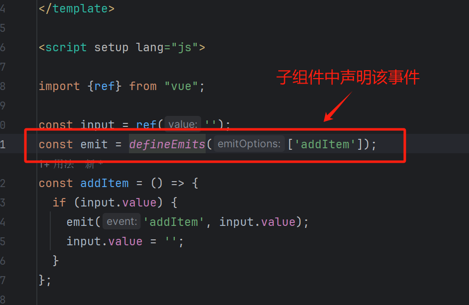
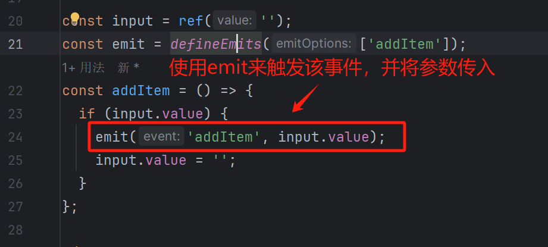

+++
title = 'Vue组件通讯方式props和自定义事件'
date = 2024-04-28T22:40:26+08:00
draft = false

categories = [
    "前端",
]

tags = [
    "vue",
    "javaScript",
]

image = "/cover/cover6.webp"
+++
> vue期中考试时整理组件通讯方式所写内容，但是由于期中考试不包含这些范围，丢掉感觉可惜，放到博客上分享。

## 使用props进行父子组件通讯

`props`是最常用的一种父传子的组件通讯方式。`props`使得组件之间实现了一个单向的绑定。子组件的数据会随父组件的更新而发生响应式的更新。

### props通讯流程图

### 通讯步骤

#### 父组件向子标签中传入数据

在父组件中往子组件的属性进行写入传参

#### 子组件定义props对数据进行接收

子组件中通过`defineProps()`定义`props`，接收父组件传入的数据。

如果有未被子组件`props`接收的数据，那么父传入子的数据会被存入子组件的`attrs`属性中，如上图的`tmp`。

#### 子组件访问数据

## 使用自定义事件进行子父组件通讯

自定义事件是一种子组件对父组件的通讯方式。父组件通过在子组件上绑定一个自定义事件，在子组件中声明这个事件，这样子组件能够触发这个事件，从而实现组件间通讯。

### 自定义事件通讯流程图

### 通讯步骤

#### 定义事件

  在父组件中用@事件名的方式定义一个自定义事件。

  

#### 声明事件

  在子组件中使用`defineEmits([事件1、事件2...])`的方式来声明该事件，并且得到事件触发函数。

  

#### 触发事件

  在组件中使用`emit(事件名，参数列表...)`的方式来触发事件，并将参数信息进行回传。

  