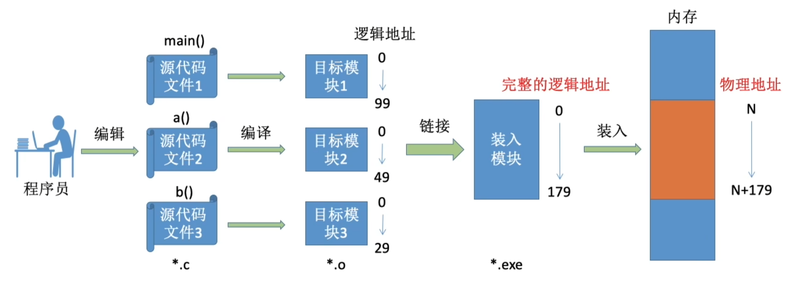

+++
title = '操作系统学习记录——内存'
date = 2024-04-22T22:14:59+08:00
draft = false
math = true
categories = [
    "学习记录",
    "操作系统"    
]

tags = [
    "操作系统",
]

image = "/cover/cover4.webp"
+++

## 什么是内存

 内存可存放数据。程序执行前需要先放到内存中才能被CPU处理———缓和cpu与硬盘之间的速度矛盾。

操作系统如何区分，各个程序存放数据的地方？

内存中有多个小房间称为**存储单元**。每个存储单元都有一个地址编码。内存地址从0开始。

如果计算机”按字节编址“，则每个存储单元大小为1字节，即1B，即8个二进制位。

如果字长为16位的计算机”按字编址“，则每个存储单元大小位1个字；每个字的大小为16个二进制位。

**所以每个存储单元的存储数据是要看计算机的设计的。**

> _补充：几个常用的数量单位_  
> $2^{10} = 1k$  
> $2^{20} = 1M$  
> $2^{30} = 1G$

    思考如果进程的地址不是从0开始的，会不会导致问题？

    不会，程序经过编译、链接后生成的指令中指明的是逻辑地址（相对地址），即：相对于进程的起始地址而言的
    地址。如果指令中指明的地址是物理地址则会有这样的问题。
## 内存装入方式

### 绝对装入

绝对装入:在编译时，如果知道程序将放到内存中的哪个位置，编译程序将产生绝对地址的目标代码。
装入程序按照装入模块中的地址，将程序和数据装入内存。

特点：程序装入内存的位置固定，不利于多道程序设计,只适用于单道程序设计。

### 可重定位装入

静态重定位:又称可重定位装入。编译、链接后的装入模块的地址都是从0开始的，指令中使用的地址、数据存放的地址都是相对于起始地址而言的逻辑地址。可根据内存的当前情况，将装入模块装入到内存的适当位置。装入时对地址进行“重定位”，将逻辑地址变换为物理地址(地址变换是在装入时一次完成的)。

例如，装入的起始物理地址为100，则所有地址相关的参数都加100。

特点：静态重定位的特点是在一个作业装入内存时，必须分配其要求的全部内存空间，如果没有足够的内存，就不能装入该作业。作业一旦进入内存后，在运行期间就不能再移动，也不能再申请内存空间。

### 动态运行时装入

动态重定位:又称动态运行时装入。编译、链接后的装入模块的地址都是从0开始的。装入程序把装入模块装入内存后，并不会立即把逻辑地址转换为物理地址，而是把地址转换推迟到程序真正要执行时才进行。因此装入内存后所有的地址依然是逻辑地址。这种方式需要一个重定位寄存器的支持。

重定位寄存器：在CPU中设置一个寄存器，用来存放当前程序的起始物理地址。当程序执行时，CPU通过重定位寄存器将逻辑地址转换为物理地址。他会执行相加操作。

特点：并且可将程序分配到不连续的存储区中;在程序运行前只需装入它的部分代码即可投入运行，然后在程序运行期间，根据需要动态申请分配内存;便于程序段的共享，可以向用户提供一个比存储空间大得多的地址空间。

## 程序运行过程

### 链接、编译、装入

编译:由编译程序将用户源代码编译成若干个目标模块(编译就是把高级语言翻译为机器语言)  

链接:由链接程序将编译后形成的一组目标模块，以及所需库函数链接在一起，形成一个完整的装入模块 

装入(装载):由装入程序将装入模块装入内存运行

### 链接的三种方式

#### 静态链接

在程序运行之前先将各目标模块及它们所需的库函数连接成一个完整的可执行文件(装入模块)，之后不再拆开。

#### 装入时静态链接

将各目标模块装入内存时，边装入边链接的链接方式。

#### 运行时动态链接

在程序执行中需要该目标模块时，才对它进行链接。其优点是便于修改和更新，便于实现对目标模块的共享。