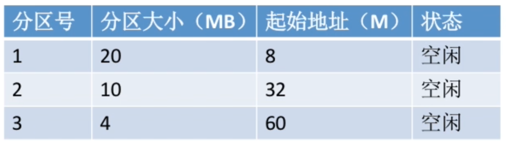

+++
title = '操作系统学习记录——内存分配'
date = 2024-04-24T19:12:26+08:00
draft = false
categories = [
    "学习记录",
    "操作系统"    
]

tags = [
    "操作系统",
]

image = "/cover/cover5.webp"
+++

## 内存管理需要实现的功能

- 空间的分配与回收
- 地址转换（三种装入方式）
- 内存扩充（虚拟内存技术）
- 内存保护 

## 内存保护

方法一：在CPU中设置一对上、下限寄存器，存放进程的上、下限地址。的指令要访问某个地址进程时，CPU检查是否越界。

方法二：采用重定位寄存器(又称基址寄存器)和界地址寄存器(又称限长寄存器)进行越界检查。重定位寄存器中存放的是进程的起始物理地址。界地址寄存器中存放的是进程的最大逻辑地址。

## 内存扩充

### 覆盖技术

将程序分为多个段(多个模块)常用的段常驻内存，不常用的段在需要时调入内存。
内存中分为一个“固定区”和若干个“覆盖区“。
需要常驻内存的段放在“固定区”中，调入后就不再调出(除非运行结束)。不常用的段放在“覆盖区”需要用到时调入内存，用不到时调出内存。

按照自身逻辑结构，让那些不可能同时被访问的程序段共享同一个覆盖区。

必须由程序员声明覆盖结构，操作系统完成自动覆盖。缺点:对用户不透明，增加了用户编程负担。

覆盖技术已经退出历史舞台。

### 交换技术

内存空间紧张时，系统将内存中某些进程暂时换出外存，把外存中某些已具备运行条件的进程换入内存(进程在内存与磁盘间动态调度)。

具有对换功能的操作系统中，通常把磁盘空间分为文件区和对换区两部分。文件区主要用于存放文件，主要追求存储空间的利用率，因此对文件区空间的管理采用离散分配方式;对换区空间只占磁盘空间的小部分，被换出的进程数据就存放在对换区。由于对换的速度直接影响到系统的整体速度，因此对换区空间的管理主要追求换入换出速度，因此通常对换区采用连续分配方式(学过文件管理章节后即可理解)。总之，对换区的I/0速度比文件区的更快。

交换通常在许多进程运行且内存吃紧时进行，而系统负荷降低就暂停。例如:在发现许多进程运行时经常发生缺页，就说明内存紧张，此时可以换出一些进程;如果缺页率明显下降，就可以暂停换出。

可优先换出阻塞进程:可换出优先级低的进程:为了防止优先级低的进程在被调3入内存后很快又被换出，有的系统还会考虑进程在内存的驻留时间。
（注意:PCB 会常驻内存，不会被换出外存）

## 内存空间的分配与回收

> 连续分配是指在内存中为进程分配一块连续的内存空间。非连续分配是指在内存中为进程分配多个不相邻的内存块。

### 单一连续分配

在单一连续分配方式中，内存被分为系统区和用户区系统区通常位于内存的低地址部分，用于存放操作系统相关数据;用户区用于存放用户进程相关数据。内存中只能有一道用户程序，用户程序独占整个用户区空间。

优点:实现简单;无外部碎片;可以采用覆盖技术扩充内存;不一定需要采取内存保护(eg:早期的PC操作系统 MS-DOS)

缺点：只能用于单用户、单任务的操作系统中；有内部碎片；储存器利用率极低。

### 固定分区分配

20世纪60年代出现了支持多道程序的系统，为了能在内存中装入多道程序，且这些程序之间又不会相互干扰，于是将整个用户空间划分为若干个固定大小的分区，在每个分区中只装入一道作业，这样就形成了最早的、最简单的一种可运行多道程序的内存管理方式。

#### 分区大小相等

分区大小相等缺少灵活性，但是很适合用于用一台计算机控制多个相同对象的场合

#### 分区大小不等

增加了灵活性，可以满足不同大小的进程需求。根据系统中运行的进程情况进行划分。

> _分区说明表_  
> 操作系统需要建立一个数据结构--分区说明表，来实现各个分区的分配与回收。每个表项对应一个分区，通常按分区大小排列。

缺点： 当用户程序太大时，可能所有的分区都不能满足要求，此时不得不采用覆盖技术来解决，但这又会降低性能。 会产生内部碎片，内存利用率低。

### 动态分区分配

动态分区分配又称为可变分区分配。这种分配方式不会预先划分内存分区，而是在进程装入内存时根据进程的大小动态地建立分区，并使分区的大小正好适合进程的需要。因此系统分区的大小和数目是可变的。(eg:假设某计算机内存大小为64MB，系统区8MB，用户区共56MB..)

#### 用什么样的数据结构记录内存的使用情况？

> **_空闲分区表_**  
>
>每个空闲分区对应一个表项表项。表项中包含分区号、分区大小、分区起始地址等信息

> **_空闲分区链_**
>
>每个分区的起始部分和末尾部分分别设置前向指针和后向指针。起始部分处还可记录分区大小等信息.

#### 当有很多空闲分区时，如何选择合适的分区？

按照一定的[动态分区分配算法](http://150.158.146.137/p/%E5%8A%A8%E6%80%81%E5%88%86%E5%8C%BA%E5%88%86%E9%85%8D%E7%AE%97%E6%B3%95/)，从空闲的分区中选择一个合适的分区分配给进程。常用的动态分区分配算法有：首次适应算法、最佳适应算法、最坏适应算法。

#### 如何进行分区的分配和回收？

- 分配：当一个进程需要内存时，操作系统会根据进程的大小从空闲分区表中选择一个合适的分区分配给进程。分配后，操作系统需要更新空闲分区表。

- 回收：当一个进程运行结束时，操作系统会回收进程所占用的内存。回收后，操作系统需要更新空闲分区表。

> **_内部碎片_**  
> 分配给某进程的内存区域中，如果有些部分没有用上。  
> 
> **_外部碎片_**  
> 分配给某进程的内存区域中，如果有些部分没有用上。

